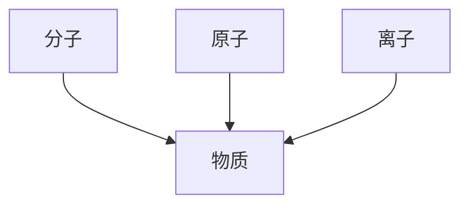
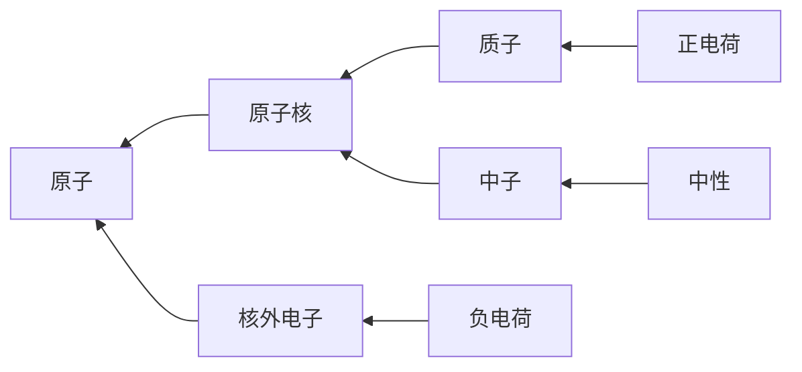

# 物质的结构

直接构成物质的微粒有分子、原子、离子三种。

```mermaid
graph TB;
分子-->物质
原子-->物质
离子-->物质
```

## 分子

分子是保持保持物质原有化学性质的一种微粒。物质的物理性质是由大量分子和离子聚集在一起才表现出来的。

## 原子

原子时化学变化中的最小微粒。在化学变化中，原子不可分。

```mermaid
graph RL
原子核-->原子
核外电子 -->原子
质子 -->原子核
中子-->原子核
正电荷 -->质子
负电荷-->核外电子
中性-->中子
```